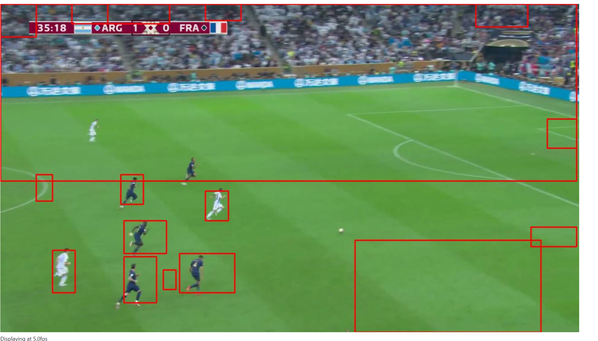

# Proyecto de Automatización del Hogar con Home Assistant y Frigate

Este proyecto utiliza Docker para desplegar una solución de automatización del hogar con Home Assistant y Frigate para el reconocimiento de objetos en tiempo real a través de cámaras IP.

## Componentes

### Home Assistant
- **Descripción**: Home Assistant es una plataforma de automatización del hogar de código abierto que permite controlar y automatizar dispositivos inteligentes.
- **Puerto**: 8123
- **Volumen**: `./config/home-assistant` se monta en `/config` dentro del contenedor para almacenar la configuración.
- **Variables de Entorno**:
    - `TZ`: Configura la zona horaria del contenedor, en este caso `America/Los_Angeles`.

### Frigate
- **Descripción**: Frigate es un sistema de NVR con detección de objetos en tiempo real para cámaras IP.
- **Puerto**: 5000
- **Volumen**:
    - `./storage/frigate` se monta en `/media/frigate` para almacenar grabaciones y clips.
    - `./config/frigate` se monta en `/config` para la configuración de Frigate.
- **Variables de Entorno**:
    - `FRIGATE_RTSP_USERNAME`: Nombre de usuario para la autenticación RTSP, aún no configurado.
    - `FRIGATE_RTSP_PASSWORD`: Contraseña para la autenticación RTSP, aún no configurado.
- **Otras Configuraciones**:
    - `shm_size`: Configura el tamaño de la memoria compartida a 64m para evitar problemas de memoria con las cámaras.
    - `tmpfs`: `/tmp/cache` se utiliza para almacenar temporalmente los datos de video para el procesamiento.
- **local_network**: Una red local definida para permitir la comunicación entre los servicios de Home Assistant y Frigate.


### Ejemplo de Deteccion de Objetos
Aquí se muestra un ejemplo de detección de objetos utilizando Frigate:
<br/>


## Cómo Ejecutar

Para iniciar el proyecto, asegúrate de tener Docker y Docker Compose instalados en tu sistema. Luego, ejecuta el siguiente comando en la terminal en el directorio del proyecto:

```bash
docker-compose up -d
```

Este comando descargará las imágenes necesarias y creará los contenedores definidos en docker-compose.yml, ejecutándolos en modo desacoplado.

Acceso a los Servicios
Home Assistant: Accede a Home Assistant navegando a http://localhost:8123 en tu navegador.
Frigate: Accede a la interfaz de Frigate navegando a http://localhost:5000 en tu navegador.
Para más información sobre la configuración y personalización de cada componente, consulta la documentación oficial de Home Assistant y Frigate.